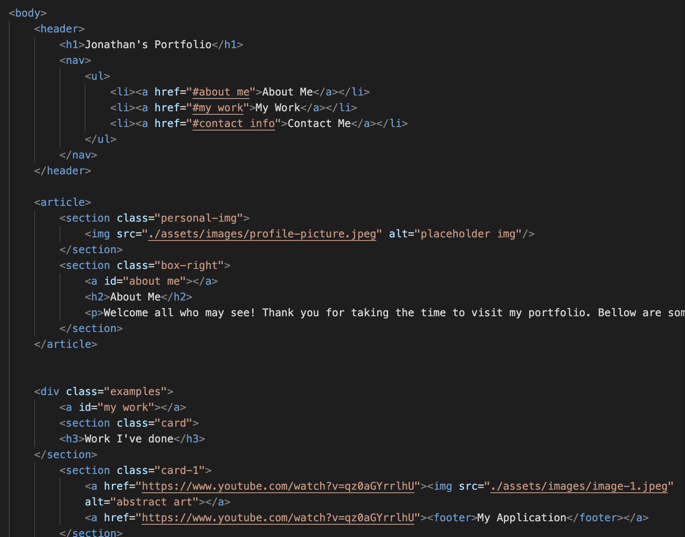
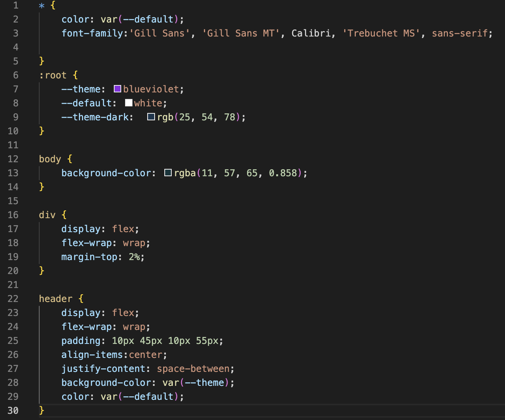

# Jonathans Portfolio

## Description

[Link to deployed site] (https://jonnyboy808.github.io/jonathans-portfolio/)

This webpage was created to as a quick and easy access to my personal portfolio. Using this site you will be able to see the projects that I have worked on and will also notice the resizing to better fit smaller media screen sizes. The images contained within my portfolio will take you to my applications that I have deployed, currently there are placeholder links at this time but they will be updated in the near future.

## Installation

N/A

## Usage

You can use this site to find out information on specific topics that I have personally worked on. You may also use the header withing this site to quickly navigate to the specific sections of the website quickly. Additionally the footer may be used to quickly get in contact with myself.

Here is an example of the HTML code used:

Additionally here is an example of the CSS file code:

## Credits

N/A

## License

No license at this time